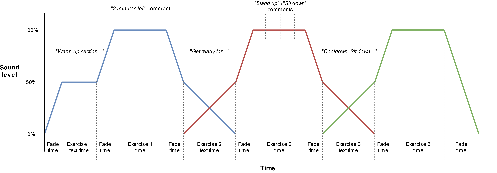

# SpinGen
## An exercise audio generator for hands-free training
SpinGen is a python3 program which allows you to create audio files for training, without looking at a reference screen, which requires you to perform at a certain BPM. This is a program which I use and created for when I do indoor cycling, also known as spinning. The software allows you to pre-define a list of .json objects in which you define the tempo (BPM), exercise description and length. Then you supply your own .mp3 files - with the music you like and the tempo you need for the exercise program you created - and the software randomly chooses the right music and adds text-to-speech voice to explain the exercise.

For example, the dummy_program.json inside program_examples/, will generate a 12 minute and 49 second long .mp3 file, which contains 3 exercises. Below the output/generated_program_sound.mp3 is explained. 



### Generating the dummy_program.json
The current repo contains the songs (generated click tracks) and a dummy program, which can be run by simply running the main python file
```python
> python main.py
```

### Changing parameters
You can change several parameters, by altering the default_settings.ini file, which contains a number of settings

You can also create your own .ini file and pass its path as an argument to main.py
```python
> python main.py "./my_own_settings.ini"
```

### Dependencies
The project has the following dependencies:
```
gTTS : 2.1.0 or greater
pydub : 0.23.1 or greater
```
